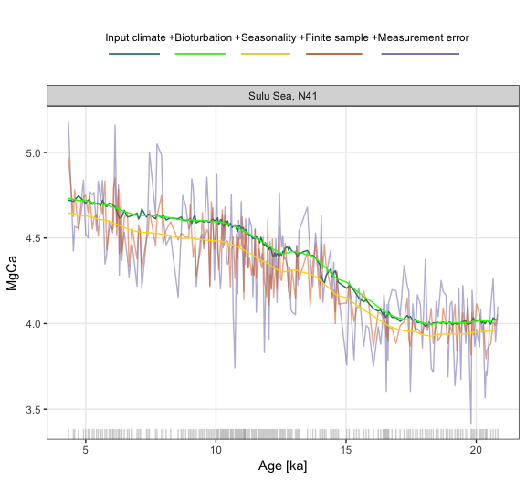

# Sedproxy: Simulation of Sediment Archived Climate Proxy Records.

------------------------------

## Introduction

`sedproxy` provides a forward model for sediment archived climate proxies. It is based on work described in Laepple and Huybers (2013). A manuscript is in preparation, Dolman and Laepple (in prep.), which will more fully describe the forward model and its applications. Please contact Dr Andrew Dolman <<andrew.dolman@awi.de>>, or Dr Thomas Laepple <<tlaepple@awi.de>>, at the Alfred-Wegener-Institute, Helmholtz Centre for Polar and Marine Research, Germany, for more information.

 
## Installation

**sedproxy** can be installed directly from bitbucket


```r
if (!require("devtools")) {
  install.packages("devtools")
}

devtools::install_bitbucket("ecus/sedproxy")
```

## Example data

`sedproxy` includes example data for a single sediment core and location: core number 41 in the Shakun et al. (2012) compilation (MD97-2141, Rosenthal et al. 2003). The climate signal is taken from the [TraCE-21ka](http://www.cgd.ucar.edu/ccr/TraCE/) Simulation of Transient Climate Evolution over the last 21,000 years, using the grid cell closest to core MD97-2141. Seasonality of *G.ruber*, the Foraminifera for which test Mg/Ca ratios were measured, is taken from the model of Fraile et al (2008). Sediment accumulation rates were estimated from the depth and age data associated with core MD97-2141, with a minimum rate of 0.2 * the mean rate.


**The MD97-2141 core**


```r
library(tidyverse)
library(knitr)
library(sedproxy)
```


```r
knitr::kable(N41.proxy.details %>% tidyr::gather(), format = "markdown")
```


|key             |value                                            |
|:---------------|:------------------------------------------------|
|Number          |41                                               |
|ID.no           |N41                                              |
|Core            |MD97-2141                                        |
|Location        |Sulu Sea                                         |
|Proxy           |Mg/Ca                                            |
|Lat             |8.78333                                          |
|Lon             |121.2833                                         |
|Elevation       |-3633.000000                                     |
|Reference       |Rosenthal et al., 2003                           |
|Resolution      |77.8894472361809                                 |
|Calibration.ref |Rosenthal and Lohman, 2002                       |
|Calibration     |T = ln(MgCa/0.28)/0.095                          |
|Foram.sp        |G. ruber                                         |
|Ref.14C         |de Garidel-Thoron et al., 2001, Paleoceanography |
|Notes           |NA                                               |
|Geo.cluster     |Sulu Sea                                         |
|Archive.type    |Marine sediment                                  |


**Modelled climate signal**

The first 5 rows:


```r
knitr::kable(N41.t21k.climate[1:5,], format = "markdown")
```


|        1|        2|        3|        4|        5|        6|        7|        8|        9|       10|       11|       12|
|--------:|--------:|--------:|--------:|--------:|--------:|--------:|--------:|--------:|--------:|--------:|--------:|
| 297.8568| 297.3878| 298.0602| 299.2245| 299.6761| 300.2167| 300.5483| 299.9182| 299.6400| 299.6386| 299.9301| 299.3381|
| 297.9886| 297.5341| 297.8263| 299.0083| 299.7151| 299.6743| 300.1609| 300.6685| 299.7819| 299.8497| 299.7823| 298.9699|
| 297.8427| 297.7466| 298.3599| 299.1459| 299.6056| 300.0913| 300.1500| 300.1423| 299.5427| 299.5985| 299.8105| 298.9172|
| 297.6961| 297.6659| 298.4921| 299.5137| 300.0200| 299.8971| 300.4432| 299.9803| 299.6973| 300.0648| 299.7363| 298.9907|
| 297.7691| 297.3436| 297.9452| 299.1741| 299.9940| 299.8244| 300.1444| 300.3978| 299.9496| 300.1610| 299.8150| 298.9635|

**Actual proxy record**

Core MD97-2141 (Rosenthal et al. 2003)


```r
kable(head(N41.proxy), format = "markdown")
```


| Published.age| Published.temperature| Sed.acc.rate.m.yr|
|-------------:|---------------------:|-----------------:|
|      4334.286|                 28.92|         0.0003679|
|      4527.429|                 29.20|         0.0003675|
|      4575.714|                 29.15|         0.0003677|
|      4720.571|                 28.55|         0.0003677|
|      4913.714|                 28.33|         0.0003670|
|      4994.400|                 29.44|         0.0003667|

*******

## Function `ClimToProxyClim`

`ClimToProxyClim` is the main function in package `sedproxy`. It simulates a sediment archived proxy from an assumed true climate signal, the sediment accumulation rate, seasonality of the encoding organism/process, and the number of samples per timepoint.


```r
set.seed(26052017)

PFM <- ClimToProxyClim(clim.signal = N41.t21k.climate[nrow(N41.t21k.climate):1,] - 273.15, 
                       timepoints = N41.proxy$Published.age,
                       proxy.calibration.type = "identity",
                seas.prod = N41.G.ruber.seasonality,
                sed.acc.rate = N41.proxy$Sed.acc.rate.m.yr,
                meas.noise = 0.46, n.samples = 30,
                n.replicates = 10)
```

```
## Warning in FUN(X[[i]], ...): Window extends below end of clim.signal
```

```
## Warning in FUN(X[[i]], ...): Bioturbation window extends below end of
## clim.signal

## Warning in FUN(X[[i]], ...): Bioturbation window extends below end of
## clim.signal
```


```r
names(PFM)
```

```
## [1] "simulated.proxy" "smoothed.signal" "everything"
```


```r
head(PFM$simulated.proxy)
```

```
## # A tibble: 6 x 16
##   timepoints clim.signal.ann clim.timepoints.1000 clim.timepoints.100
##        <dbl>           <dbl>                <dbl>               <dbl>
## 1   4334.286        28.02843             27.93745            27.91754
## 2   4527.429        27.64365             27.92579            27.90224
## 3   4575.714        27.85549             27.92432            27.89784
## 4   4720.571        27.78637             27.91322            27.93882
## 5   4913.714        28.10193             27.89451            27.90577
## 6   4994.400        28.02830             27.89069            27.88720
## # ... with 12 more variables: clim.timepoints.50 <dbl>, proxy.bt <dbl>,
## #   proxy.bt.sb <dbl>, sed.acc.rate <dbl>, smoothing.width <dbl>,
## #   proxy.bt.sb.sampY <dbl>, proxy.bt.sb.sampYM <dbl>,
## #   proxy.bt.sb.inf.b <dbl>, proxy.bt.sb.inf.b.n <dbl>,
## #   proxy.bt.sb.sampYM.b <dbl>, proxy.bt.sb.sampYM.b.n <dbl>,
## #   simulated.proxy <dbl>
```

**Simple plotting**


```r
plot.df <- PFM$simulated.proxy %>% 
  select(timepoints, clim.timepoints.50, proxy.bt, proxy.bt.sb,
         proxy.bt.sb.sampYM, proxy.bt.sb.sampYM.b.n) %>% 
  gather(Stage, Temperature, -timepoints) %>% 
  mutate(Age = timepoints,
         Temperature = Temperature) 

plot.df %>% 
  # Add Location and ID.no for plotting function 
  mutate(Location = "Sulu Sea", 
         ID.no = "N41") %>% 
  PlotPFMs(.)
```

```
## Warning: Unknown or uninitialised column: 'Proxy'.
```

```
## Scale for 'alpha' is already present. Adding another scale for 'alpha',
## which will replace the existing scale.
```

<!-- -->


**The 10 replicates of the final simulated proxy**


```r
head(PFM$everything$proxy.bt.sb.sampYM.b.n)
```

```
##          [,1]     [,2]     [,3]     [,4]     [,5]     [,6]     [,7]
## [1,] 28.59077 27.24216 27.85101 27.82210 28.74879 27.67043 28.23568
## [2,] 27.38899 27.74220 27.17901 27.67571 28.97121 27.13761 26.69763
## [3,] 28.61761 28.02140 27.98333 27.54683 27.49677 27.94618 27.71461
## [4,] 27.67856 27.10352 28.39432 26.83184 27.48668 27.38606 28.26002
## [5,] 27.50167 27.73817 27.50510 29.26476 27.52106 28.31881 28.45814
## [6,] 27.83441 27.93680 26.63038 27.21916 28.40145 27.23655 27.37571
##          [,8]     [,9]    [,10]
## [1,] 27.60570 28.44858 27.47944
## [2,] 27.63600 28.05558 28.13290
## [3,] 28.48741 27.18754 27.96795
## [4,] 27.79744 27.76411 27.48290
## [5,] 28.66557 28.20030 28.47205
## [6,] 28.06648 28.03758 27.63359
```


### Proxy types

The initial input climate signal is converted into "proxy units" if a `proxy.calibration.type` is specified. This simulates the Environment -> Sensor stage of the proxy system.


```r
PFM_2 <- ClimToProxyClim(clim.signal = N41.t21k.climate[nrow(N41.t21k.climate):1,] - 273.15, 
                         timepoints = N41.proxy$Published.age,
                         proxy.calibration.type = "MgCa",
                         seas.prod = N41.G.ruber.seasonality,
                         sed.acc.rate = N41.proxy$Sed.acc.rate.m.yr,
                         meas.noise = 0.46, n.samples = 30,
                         n.replicates = 10)
```

```
## Warning in FUN(X[[i]], ...): Window extends below end of clim.signal
```

```
## Warning in FUN(X[[i]], ...): Bioturbation window extends below end of
## clim.signal

## Warning in FUN(X[[i]], ...): Bioturbation window extends below end of
## clim.signal
```


**Simple plotting**


```r
plot.df <- PFM_2$simulated.proxy %>% 
  select(timepoints, clim.timepoints.50, proxy.bt, proxy.bt.sb,
         proxy.bt.sb.sampYM, proxy.bt.sb.sampYM.b.n) %>% 
  gather(Stage, Temperature, -timepoints) %>% 
  mutate(Age = timepoints,
         Temperature = Temperature) 

plot.df %>% 
  # Add Location and ID.no for plotting function 
  mutate(Location = "Sulu Sea", 
         ID.no = "N41") %>% 
  PlotPFMs(.) +
  labs(y = "MgCa")
```

```
## Warning: Unknown or uninitialised column: 'Proxy'.
```

```
## Scale for 'alpha' is already present. Adding another scale for 'alpha',
## which will replace the existing scale.
```

<!-- -->


## Literature cited

Fraile, I., Schulz, M., Mulitza, S., & Kucera, M. (2008): Predicting the global distribution of planktonic foraminifera using a dynamic ecosystem model. Biogeosciences, 5: 891–911.

Laepple, T., & Huybers, P. (2013): Reconciling discrepancies between Uk37 and Mg/Ca reconstructions of Holocene marine temperature variability. Earth and Planetary Science Letters, 375: 418–429.

Rosenthal, Y., Oppo, D. W., & Linsley, B. K. (2003): The amplitude and phasing of climate change during the last deglaciation in the Sulu Sea, western equatorial Pacific. Geophys. Res. Lett., 30: 1428.

Shakun, J. D., Clark, P. U., He, F., Marcott, S. A., Mix, A. C., Liu, Z., Otto-Bliesner, B., Schmittner, A., & Bard, E. (2012): Global warming preceded by increasing carbon dioxide concentrations during the last deglaciation. Nature, 484: 49–54.


