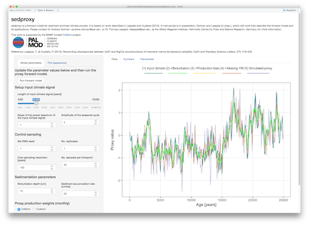

# Sedproxy: Simulation of Sediment Archived Climate Proxy Records.

-------

## Introduction

`sedproxy` provides a forward model for sediment archived climate proxies. It is based on work described in Laepple and Huybers (2013). A manuscript is in review at Climate of the Past Discussions, which more fully describes the forward model and its applications [(Dolman and Laepple, in review)](https://www.clim-past-discuss.net/cp-2018-13/).


Please contact Dr Andrew Dolman <<andrew.dolman@awi.de>>, or Dr Thomas Laepple <<tlaepple@awi.de>>, at the Alfred-Wegener-Institute, Helmholtz Centre for Polar and Marine Research, Germany, for more information.

This work was supported by German Federal Ministry of Education and Research (BMBF) as Research for Sustainability initiative [FONA](https://www.fona.de/) through the [PalMod](https://www.palmod.de/) project (FKZ: 01LP1509C). 


## Installation

**sedproxy** can be installed directly from bitbucket


```r
if (!require("devtools")) {
  install.packages("devtools")
}

devtools::install_bitbucket("ecus/sedproxy")
```

## Shiny app

A Shiny app provides a graphical user interface to the main `sedproxy` function `ClimToProxyClim`. Currently this app forward models a proxy from a randomly generated input climate and serves only to illustrate the functionality of `sedproxy`. The user can alter the parameters of the forward model and observe the results graphically. In future versions it may be possible to load input climates and other input parameters from a file and to save the output.

To run the Shiny app enter the following in the R terminal:


```r
library(sedproxy)
ShinySedproxy()
```



An online version of the Shiny app is hosted at [shinyapps.io](https://limnolrgy.shinyapps.io/sedproxy-shiny/)


Below are some brief examples of how to run `sedproxy` from a script or the command line.

## Example data

`sedproxy` includes example data for a single sediment core and location: core number 41 in the Shakun et al. (2012) compilation (MD97-2141, Rosenthal et al. 2003). The climate signal is taken from the [TraCE-21ka](http://www.cgd.ucar.edu/ccr/TraCE/) Simulation of Transient Climate Evolution over the last 21,000 years, using the grid cell closest to core MD97-2141. Seasonality of *G.ruber*, the Foraminifera for which test Mg/Ca ratios were measured, is taken from the model of Fraile et al (2008). Sediment accumulation rates were estimated from the depth and age data associated with core MD97-2141, with a minimum rate of 0.2 * the mean rate.


**The MD97-2141 core**


```r
library(tidyverse)
library(knitr)
library(sedproxy)
```


```r
N41.proxy.details %>% 
  mutate_if(is.numeric, round, digits = 2) %>% 
  gather() %>% 
  kable(., format = "markdown", digits = 2)
```


|key             |value                                            |
|:---------------|:------------------------------------------------|
|Number          |41                                               |
|ID.no           |N41                                              |
|Core            |MD97-2141                                        |
|Location        |Sulu Sea                                         |
|Proxy           |Mg/Ca                                            |
|Lat             |8.78                                             |
|Lon             |121.28                                           |
|Elevation       |-3633.000000                                     |
|Reference       |Rosenthal et al., 2003                           |
|Resolution      |77.89                                            |
|Calibration.ref |Rosenthal and Lohman, 2002                       |
|Calibration     |T = ln(MgCa/0.28)/0.095                          |
|Foram.sp        |G. ruber                                         |
|Ref.14C         |de Garidel-Thoron et al., 2001, Paleoceanography |
|Notes           |NA                                               |
|Geo.cluster     |Sulu Sea                                         |
|Archive.type    |Marine sediment                                  |


**Input climate signal**

The first 5 rows:


```r
(N41.t21k.climate[1:5,]-273.15) %>% 
  kable(., format = "markdown", digits = 2)
```


|     1|     2|     3|     4|     5|     6|     7|     8|     9|    10|    11|    12|
|-----:|-----:|-----:|-----:|-----:|-----:|-----:|-----:|-----:|-----:|-----:|-----:|
| 24.71| 24.24| 24.91| 26.07| 26.53| 27.07| 27.40| 26.77| 26.49| 26.49| 26.78| 26.19|
| 24.84| 24.38| 24.68| 25.86| 26.57| 26.52| 27.01| 27.52| 26.63| 26.70| 26.63| 25.82|
| 24.69| 24.60| 25.21| 26.00| 26.46| 26.94| 27.00| 26.99| 26.39| 26.45| 26.66| 25.77|
| 24.55| 24.52| 25.34| 26.36| 26.87| 26.75| 27.29| 26.83| 26.55| 26.91| 26.59| 25.84|
| 24.62| 24.19| 24.80| 26.02| 26.84| 26.67| 26.99| 27.25| 26.80| 27.01| 26.67| 25.81|

**Actual proxy record**

Core MD97-2141 (Rosenthal et al. 2003)


```r
kable(head(N41.proxy), format = "markdown")
```


| Published.age| Published.temperature| Sed.acc.rate.cm.ka| Proxy.value|
|-------------:|---------------------:|------------------:|-----------:|
|      4334.286|                 28.92|              36.79|       4.346|
|      4527.429|                 29.20|              36.75|       4.460|
|      4575.714|                 29.15|              36.77|       4.442|
|      4720.571|                 28.55|              36.77|       4.195|
|      4913.714|                 28.33|              36.70|       4.109|
|      4994.400|                 29.44|              36.67|       4.564|

*******

## Function `ClimToProxyClim`

`ClimToProxyClim` is the main function in package `sedproxy`. It simulates a sediment archived proxy from an assumed true climate signal, the sediment accumulation rate, seasonality of the encoding organism/process, and the number of samples per timepoint.


```r
set.seed(26052017)
clim.in <- N41.t21k.climate[nrow(N41.t21k.climate):1,] - 273.15

# The input climate signal should be a time series object
# The Trace simulation runs to the year 1990 AD, therefore the start time for 
# the input climate is -39 years BP
clim.in <- ts(clim.in, start = -39)

PFM <- ClimToProxyClim(clim.signal = clim.in,
                       timepoints = round(N41.proxy$Published.age),
                       calibration.type = "identity",
                       habitat.weights = N41.G.ruber.seasonality,
                       sed.acc.rate = N41.proxy$Sed.acc.rate.cm.ka,
                       sigma.meas = 0.23,
                       sigma.ind = 2,
                       n.samples = 30,
                       n.replicates = 10)
```


```r
PFM$everything
```

```
## # A tibble: 14,045 x 6
##    timepoints replicate stage             value scale       label          
##         <dbl>     <dbl> <chr>             <dbl> <chr>       <chr>          
##  1       4334         1 proxy.bt.sb.sampY  27.7 Proxy units (4) +Aliasing Y
##  2       4527         1 proxy.bt.sb.sampY  27.7 Proxy units (4) +Aliasing Y
##  3       4576         1 proxy.bt.sb.sampY  27.7 Proxy units (4) +Aliasing Y
##  4       4721         1 proxy.bt.sb.sampY  27.7 Proxy units (4) +Aliasing Y
##  5       4914         1 proxy.bt.sb.sampY  27.7 Proxy units (4) +Aliasing Y
##  6       4994         1 proxy.bt.sb.sampY  27.6 Proxy units (4) +Aliasing Y
##  7       5092         1 proxy.bt.sb.sampY  27.6 Proxy units (4) +Aliasing Y
##  8       5156         1 proxy.bt.sb.sampY  27.6 Proxy units (4) +Aliasing Y
##  9       5254         1 proxy.bt.sb.sampY  27.7 Proxy units (4) +Aliasing Y
## 10       5318         1 proxy.bt.sb.sampY  27.7 Proxy units (4) +Aliasing Y
## # ... with 14,035 more rows
```

**Simple plotting**


```r
PFM %>% 
  PlotPFMs(max.replicates = 1)
```

```
## Joining, by = c("stage", "scale")
```

```
## Scale for 'alpha' is already present. Adding another scale for 'alpha',
## which will replace the existing scale.
```

<!-- -->


**Plot 5 replicates of the final simulated proxy**


```r
PFM %>% 
  #filter(stage == "simulated.proxy") %>% 
  PlotPFMs(., max.replicates = 5, plot.stages = "simulated.proxy")
```

```
## Joining, by = c("stage", "scale")
```

```
## Scale for 'alpha' is already present. Adding another scale for 'alpha',
## which will replace the existing scale.
```

<!-- -->


## Literature cited

Dolman, A. M. and Laepple, T.: Sedproxy: a forward model for sediment archived climate proxies, Clim. Past Discuss., https://doi.org/10.5194/cp-2018-13, in review, 2018.

Fraile, I., Schulz, M., Mulitza, S., & Kucera, M. (2008): Predicting the global distribution of planktonic foraminifera using a dynamic ecosystem model. Biogeosciences, 5: 891–911.

Laepple, T., & Huybers, P. (2013): Reconciling discrepancies between Uk37 and Mg/Ca reconstructions of Holocene marine temperature variability. Earth and Planetary Science Letters, 375: 418–429.

Rosenthal, Y., Oppo, D. W., & Linsley, B. K. (2003): The amplitude and phasing of climate change during the last deglaciation in the Sulu Sea, western equatorial Pacific. Geophys. Res. Lett., 30: 1428.

Shakun, J. D., Clark, P. U., He, F., Marcott, S. A., Mix, A. C., Liu, Z., Otto-Bliesner, B., Schmittner, A., & Bard, E. (2012): Global warming preceded by increasing carbon dioxide concentrations during the last deglaciation. Nature, 484: 49–54.


